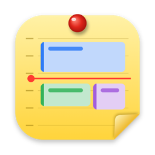
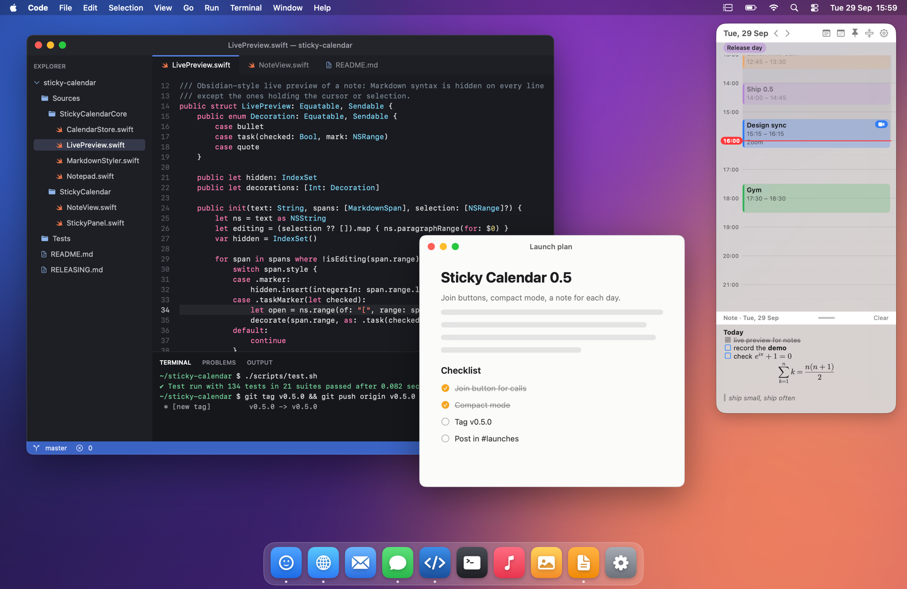
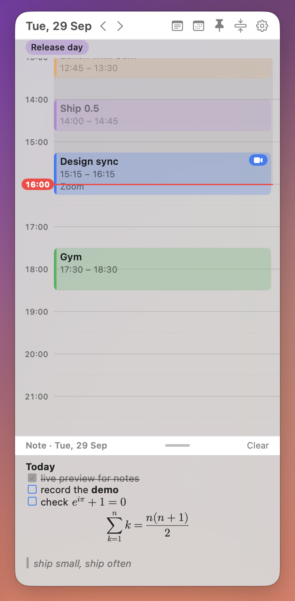
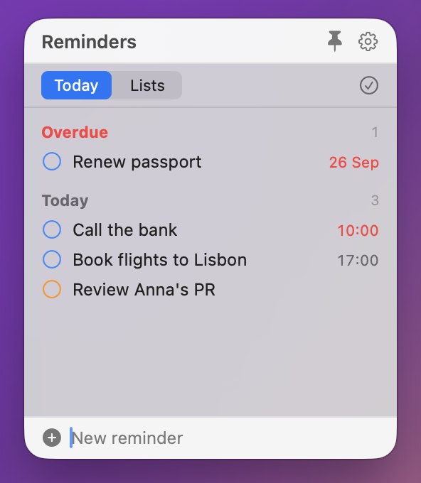
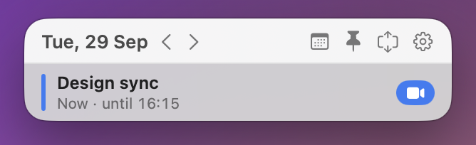

# Sticky Calendar

A tiny menu-bar app that shows the day's calendar as a floating, always-on-top timeline.

<picture>
  <source media="(prefers-color-scheme: dark)" srcset="docs/images/desktop-dark.png">
  
</picture>

<picture>
  <source media="(prefers-color-scheme: dark)" srcset="docs/images/sticky-dark.png">
  
</picture>

Scroll through the day (48 pt per hour — a taller window shows more hours); the red
ruler marks the current time. Click the date for a month picker, or scroll over it to step
through days; a red "Today" chip takes you back (or "Now", when the current time is scrolled
away). Hover the ••• button and the other buttons unfurl (click ••• to keep them open) — the
reminders and note stickies have the same menu.
Drag to create, move and resize events; ⌘- or ⇧-click to select several and move or delete
them together; double-click to edit; ⌫ to delete; ⌘Z to undo;
⌃S (or the pin button) toggles whether the sticky stays on top of other windows;
⌘O (or the calendar button) opens Calendar, optionally on the day you're viewing;
⌘R (or the ↻ button) refreshes; ⌘, (or the gear button) opens Settings; ⌘= / ⌘- zoom the timeline and note, ⌘0 resets
(also in Settings → Zoom).
Events with a Zoom, Meet, Teams, Webex or Jitsi link get a camera button that joins the call.
⌘M (or double-clicking the header) collapses the sticky to just what's on now or next;
⌃⌥S shows or hides it from any app (Settings → Shortcuts).
The checklist button shows your reminders from Apple Reminders, Todoist, TickTick or the
tasks in an Obsidian vault, either as a tab of this sticky (the default) or in their own
sticky; the first time, it asks which source and where (Settings → Reminders changes both).
Switch between Today (overdue and due today) and whole lists. Tick and add them there;
click one to change its date and time, importance (!, !!, !!!) and notes; ⌘F searches all
of them loosely ("clbnk" finds "Call the bank"); a date typed into a new one ("Call Sam tomorrow 10am") becomes its due
date. ⌃⌥R shows or hides them from any app.
The note button opens a note under the timeline (or in its own sticky, Settings → Note)
for quick, disposable thoughts — one per day by default, following the date arrows like a
journal:
Markdown renders as you type, Obsidian-style — only the line you're editing shows its
syntax, and task boxes tick with a click; LaTeX math (`$…$`, `$$…$$`) is typeset too.
Drag its bar to resize; **Clear** empties it (⌘Z brings it back).
Keyboard: ←/→ change day; ↑/↓ move between events (or scroll when none is selected);
Page Up/Down scroll; Return edits the selected event; Esc deselects.

 

  <picture>
    <source media="(prefers-color-scheme: dark)" srcset="docs/images/reminders-dark.png">
    
  </picture>
   Reminders in their own sticky (⌃⌥R) — or as a tab, in Settings → Reminders.

  <picture>
    <source media="(prefers-color-scheme: dark)" srcset="docs/images/compact-dark.png">
    
  </picture>
   Compact mode (⌘M): just what's on now or next.

## Install

- **DMG:** download `StickyCalendar-X.Y.Z.dmg` from
  [Releases](https://github.com/ievlevpn/sticky-calendar/releases), open it and drag the app
  to Applications.
- **Homebrew:** `brew install --cask ievlevpn/tap/sticky-calendar`

The app isn't notarized by Apple: the first time, open System Settings → Privacy & Security
and click **Open Anyway**.

## Updating

What's new in each version: [CHANGELOG.md](CHANGELOG.md) (also each release's notes).

The app checks for new releases once a day (Settings → Updates) and shows
**Update Available** in its menu. It never installs anything by itself: Homebrew users run
`brew upgrade --cask sticky-calendar` (the menu item copies the command), others download
the new DMG. See [RELEASING.md](RELEASING.md) for how releases are made.

## Build

Requires macOS 14+ and the Swift toolchain (Command Line Tools are enough).

    ./scripts/test.sh               # unit tests
    ./scripts/build-app.sh          # → build/StickyCalendar.app
    ./scripts/build-app.sh --install  # also copies to ~/Applications
    ./scripts/build-dmg.sh 1.2.3    # release DMG (universal, signed)

Always launch the bundle (`open build/StickyCalendar.app`), not the bare binary —
Calendar permission belongs to the signed app.

## Notes

- Builds are signed with the self-signed "Sticky Calendar Self-Signed" certificate when it's
  in your keychain (see RELEASING.md); otherwise ad-hoc, and macOS asks for Calendar access
  again after each rebuild.
- Invitations, attendees, repeat rules and alerts are edited in Calendar.app
  (popover → Open in Calendar).
